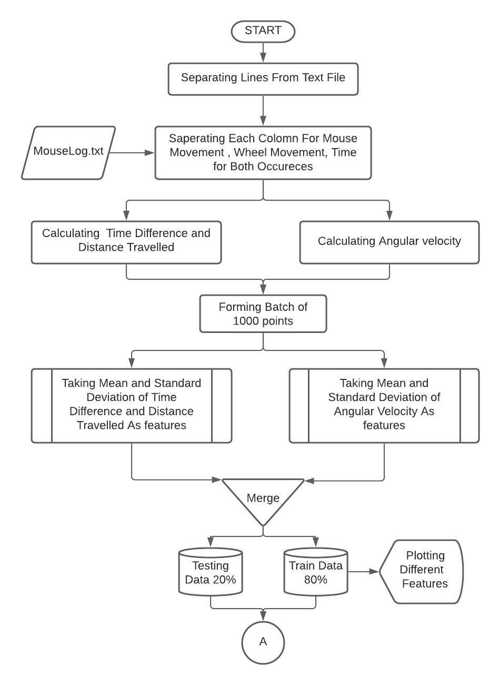
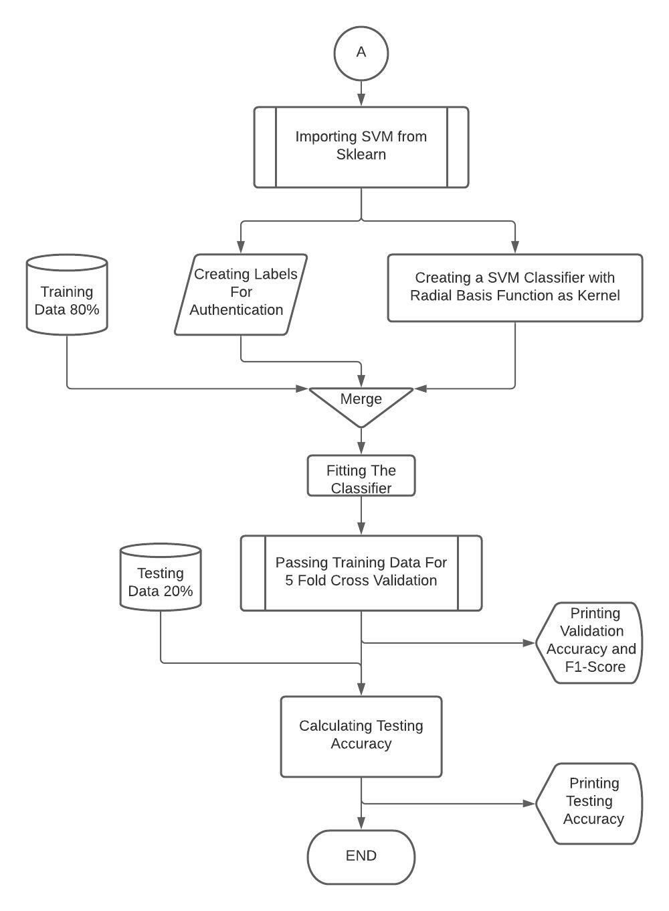

# User-identification-using-SVM-for-Mouse-Clic-data
Term Project Done as curriculum for subject : Machine Intelligence and Expert Systems in Mtech first year.

# Problem Statement
Authenticate the user by training and testing your assigned classifier by the data acquired for continuous authentication data. Use five-fold validation to report results.

# Solution Classifier
We were supposed to use Support Vector Machine (SVM) Classifier for user identification using ‘MouseLog’ data.

# Flowchart 1

# Flowchart 2

# Attribute Data Scattering

# Results

| No of features Used for training|  Validation Accuracy | Validation F1-Score| Testing | Testing |Testing |
| ------------- | ------------- |---------|-----|-----|--|
| Six | 75.37 | 0.743 | 59.25 | 91.97 | 75.61 |
| Four | 72.66 | 0.702 | 58.02 | 94.44 | 76.234 |
|Two|81.02|0.809|74.07|83.93|79.92|

